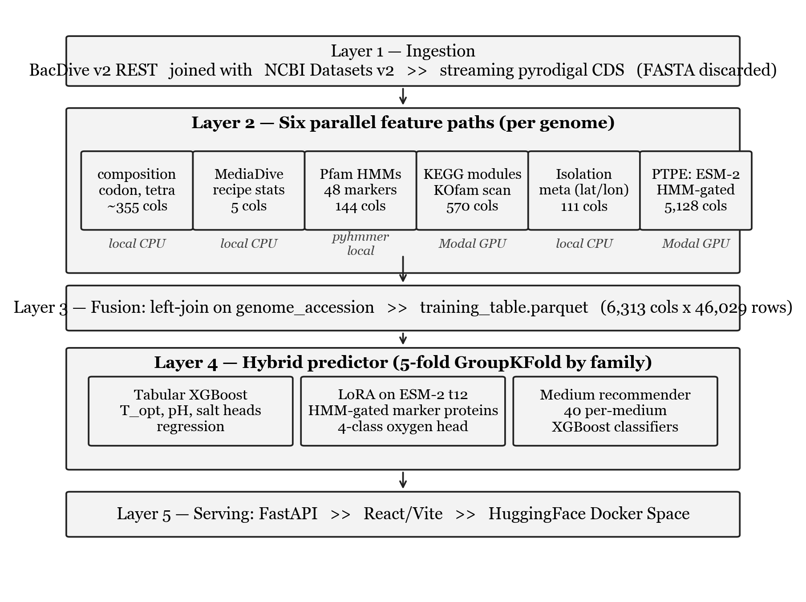
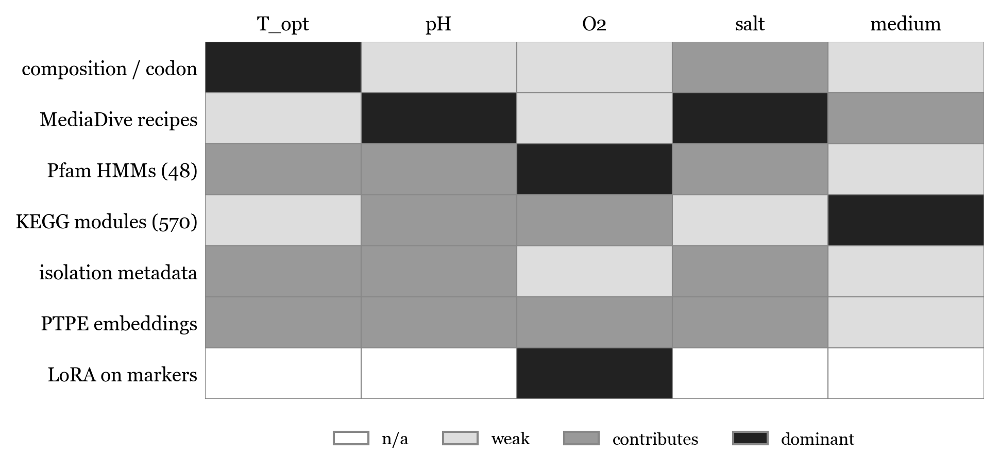
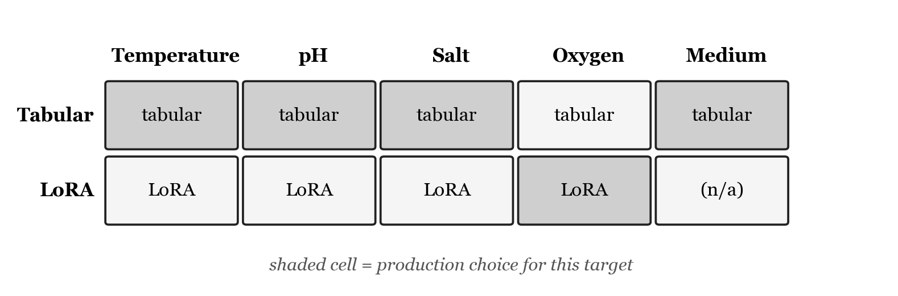

# Abstract

This document accompanies the manuscript. It visualises the production system and explains the choices behind each architectural decision: what was chosen, what alternatives existed, and what tradeoff each option represents. It is intended for readers who want to reproduce or extend the work and need to understand why each layer is the way it is.

---

# 1. System overview

The production system is a five layer pipeline. Each layer reads parquet artifacts produced by the previous layer, so any stage can be re-run independently. Six independent feature paths are computed in Layer 2 and joined into a single wide table in Layer 3.

**Figure 1.** The end to end pipeline from raw BacDive labels to a deployed prediction. Layer numbers correspond to scripts in the repository: Layer 1 is `scripts/01_*` through `scripts/02_*`; Layer 2 is `scripts/08-31`; Layer 3 is `scripts/31_merge_features.py`; Layer 4 is `scripts/03_train_baseline.py`, `scripts/10_train_media_recommender.py`, `scripts/modal_train_lora.py`, and `scripts/39_predict_hybrid.py`; Layer 5 is `api/main.py` and `web/`.

---

# 2. Per layer design decisions

## 2.1 Data source: BacDive

**What we chose.** BacDive v2 REST API as the primary label source. 46,029 strains with at least one of the four cultivation targets non null, joined to NCBI Datasets v2 genome accessions.

**Alternatives considered.**

* GTDB plus manual literature curation. Larger genome catalog but no phenotype labels.
* KOMODO. Genome to medium predictor with its own curated label set. Smaller, narrower target.
* PATRIC / BV-BRC phenotype tables. Overlaps heavily with BacDive but with thinner field coverage.

**Tradeoff.** BacDive has the largest curated cultivation phenotype set in the public literature but is survivorship biased: only organisms that have already been cultured at least once make it in. The model is therefore appropriate as a first cultivation attempt recommender, not as a guarantee that lineages with no close cultured relatives will be recoverable. This limitation is stated explicitly in the manuscript and is the reason wet lab validation is on the future work list.

## 2.2 Streaming featurization

**What we chose.** Each worker process downloads a genome FASTA from NCBI Datasets, runs pyrodigal for CDS prediction, extracts all six feature paths, and discards the FASTA. The pipeline is resumable via JSONL append logs.

**Alternatives considered.**

* Persist all FASTAs to disk for full reproducibility.
* Stream once into a single combined parquet without intermediate per path artifacts.

**Tradeoff.** Persisting 22,300 FASTAs would consume roughly 200 GB and force a different deployment story. The streaming approach trades reproducibility of the exact bytes (NCBI is mutable for some accessions over time) for fitting in a normal developer machine. The append only JSONL log preserves the exact features extracted, which is the artifact that matters for re-training.

## 2.3 Six independent feature paths

**What we chose.** Composition / codon / tetranucleotide, MediaDive recipe metadata, curated Pfam HMM markers, KEGG module completeness, isolation metadata, and phenotype targeted ESM-2 embeddings (PTPE). 6,313 features total per genome. The paths are computed independently and joined by `genome_accession`.

**Alternatives considered.**

* A single end to end deep model that learns features directly from genome sequence.
* Fewer feature paths (e.g. composition plus Pfam only, as in Koblitz 2025).

**Tradeoff.** Independent paths let XGBoost decide per target which path matters. The feature target importance matrix below shows that this matters: oxygen is dominated by Pfam HMMs and the LoRA head, medium is dominated by KEGG module completeness, and temperature is dominated by composition / codon statistics. A single end to end model could in principle learn this routing, but it would require orders of magnitude more compute and would lose the interpretability that lets us debug per target failures.

**Figure 2.** Which feature path matters for which target. Shading from white (n/a) through grey (weak / contributes) to black (dominant). LoRA on marker proteins is a target specific override only used for oxygen in the production hybrid.

## 2.4 HMM gating for PTPE

**What we chose.** Run pyhmmer against eight phenotype relevant HMM marker families, embed only the matched proteins with ESM-2 t30, and mean pool within each category.

**Alternatives considered.**

* Whole proteome ESM-2 pooling: embed every protein and average. The "naive" PLM baseline.
* Random or attention based per protein pooling without HMM gating.
* Attention pooled per category encoder instead of mean pool.

**Tradeoff.** Whole proteome pooling drowns the few phenotype relevant proteins (roughly 12 cytochromes for oxygen, for example) under the roughly 4,000 housekeeping proteins, producing a feature vector that is biologically dilute. HMM gating concentrates the signal but means we are blind to phenotype contributions from proteins we did not include in the 48 marker panel. The manuscript explicitly lists this as a limitation: targets that depend on protein families outside the 48 marker panel are likely undermodeled. Attention pooled per category is the most natural follow up and is on the future work list.

## 2.5 ESM-2 size and the LoRA upgrade

**What we chose.** Frozen ESM-2 t30 for PTPE features. Separately, LoRA fine tune ESM-2 t12 on HMM gated marker sequences and use the LoRA oxygen head in production.

**Alternatives considered.**

* Larger ESM-2 (t33) for richer features at higher compute cost.
* DNA foundation models such as Evo 2.
* Full fine tune of ESM-2 rather than LoRA adapters.

**Tradeoff.** ESM-2 t30 was the largest model that could be run on Modal A10G GPUs within a reasonable budget for 22,300 genomes. LoRA fine tuning at t12 is the smallest variant that solves the oxygen classification task; the manuscript reports macro F1 of 0.945 on fold 0, which is the strongest result in the system. Going to a larger PLM or to a DNA foundation model would likely add more lift but would require an order of magnitude more compute and is reserved for the follow up paper. Full fine tune of ESM-2 was rejected because LoRA adapters give the bulk of the benefit at less than 10% of the trainable parameter count.

## 2.6 Hybrid predictor

**What we chose.** A per target model selection stack: tabular XGBoost for temperature, pH, and salt, LoRA fine tuned ESM-2 t12 for the four class oxygen target, and the tabular MediaDive recommender for medium ranking.

**Alternatives considered.**

* A single all task model that handles every target uniformly (either pure XGBoost or pure LoRA).
* A two stage stacked model where the LoRA head provides features into a downstream XGBoost.

**Tradeoff.** Fold 0 LoRA is dramatically better at oxygen (macro F1 0.945 vs 0.402 for tabular) but worse for the continuous targets: temperature MAE 3.67 vs 2.67 °C, pH MAE 0.56 vs 0.47. A single all task model would be forced to choose between these failure modes. The hybrid lets each target use its strongest validated head and is fully reproducible from `scripts/39_predict_hybrid.py`. Every served row carries an `O2_source` flag indicating whether the prediction came from LoRA or the tabular fallback.

**Figure 3.** Production model selection matrix. Shaded cells indicate the production choice for each target. Tabular wins three of four cultivation targets and medium ranking; LoRA wins oxygen.

## 2.7 XGBoost as the tabular base

**What we chose.** XGBoost with 5 fold GroupKFold by family. Hyperparameters: `max_depth=5`, `learning_rate=0.05`, `n_estimators=500` for regression and `300` for classification, with `early_stopping_rounds=50`.

**Alternatives considered.**

* LightGBM (slightly faster training).
* scikit-learn random forests (matches Koblitz 2025).
* CatBoost (better categorical handling).
* MLP heads on top of the feature stack.

**Tradeoff.** XGBoost is the strongest single shot tabular learner on this kind of mixed numeric / sparse / interaction heavy feature matrix, handles missing values natively (essential because pH and salt labels are sparse), and trains on CPU in minutes rather than hours. LightGBM would be roughly equivalent but has less mature handling of label sparsity per target. The Koblitz 2025 reference baseline is also a tree ensemble, which keeps the comparison apples to apples.

## 2.8 Family grouped K fold

**What we chose.** 5 fold GroupKFold on the BacDive `family` field with genus then species fallback for the 4.5% of strains without a family assignment.

**Alternatives considered.**

* Random K fold (would leak family identity into train and test).
* Leave one phylum out (more demanding; required by Li et al. 2023).
* Date based split (held out by deposition year; impossible because BacDive does not consistently expose deposit dates).

**Tradeoff.** Family grouped CV controls for trivial leakage because no family appears in both train and test, but does not address the more demanding out of clade generalization. The manuscript states this explicitly as a limitation and lists leave one phylum out as the next experiment, with the caveat that 5 of 30 phyla have fewer than 50 BacDive strains and would not be statistically meaningful as held out sets.

## 2.9 Remote execution surfaces

**What we chose.** Modal A10G GPUs for the heavy stages (KOfam scan, ESM-2 embedding, LoRA training). Local Mac for everything else.

**Alternatives considered.**

* Cerebrium (used earlier, suspended after dispatch problems).
* Lambda Labs (used for one off LoRA runs).
* Kaggle notebooks (used for free GPU LoRA fallback).
* Local Mac only (tried; KOfam scan thrashed swap, ESM-2 t30 was hours per batch).
* AWS / GCP managed GPU instances (more expensive, more setup).

**Tradeoff.** Modal A10G hits the right point on the cost / latency / setup tradeoff curve for batch jobs that run for minutes to hours. Cerebrium had the most ergonomic developer experience but was unreliable for our workload at the time. Local Mac would have made the project impossible at this scale (the KOfam scan alone would have taken weeks). The cost of Modal for the published results was on the order of dozens of dollars, not hundreds.

## 2.10 Serving stack

**What we chose.** FastAPI backend serving the React / Vite frontend, deployed as a Docker container on HuggingFace Spaces.

**Alternatives considered.**

* Gradio (simpler but less control over UI; would have to rebuild the catalog browse + drawer interaction).
* Streamlit (similar tradeoff to Gradio).
* Static React on a CDN with a separately hosted prediction API (more infra to manage).
* Self hosted Docker on a VPS.

**Tradeoff.** HuggingFace Spaces gives free hosting for ML demos, automatic HTTPS, and a discoverable URL inside the academic ML community. FastAPI plus React gave the freedom to build a non trivial UI (catalog table, detail drawer, on demand prediction, NCBI lookup, accuracy panel) that Gradio or Streamlit would have made painful. The Docker setup is documented in `Dockerfile` and is portable to any container host if HuggingFace ever becomes unsuitable.

---

# 3. What the architecture optimises for

Three guiding principles run through the design choices above.

* **Reproducibility over peak performance.** Every layer writes a parquet so that any stage can be re-run independently. The pipeline can be torn down and rebuilt from BacDive plus NCBI alone in roughly 24 hours, not weeks.
* **Honest comparability.** Family grouped CV, an explicit pre-PTPE ablation baseline, a same split GenomeSPOT bake off, and a public marker sequence corpus release all exist so that the reported numbers are auditable by reviewers. The manuscript and the README both state explicitly which comparisons are same split, which are published numbers, and which are still pending.
* **Per target model selection over a single universal model.** Three years of attempts to build a "phenotype foundation model" have shown that different targets need different inductive biases. The hybrid predictor encodes this: tabular features dominate the continuous targets, LoRA on marker proteins dominates the oxygen classification. The system selects the strongest validated head for each target rather than choosing a single architecture that is mediocre at all of them.

---

# 4. What the architecture leaves open

The same parquet boundaries make several future extensions cheap:

* **Adding a new feature path** is an additive operation: write a new script that produces a per genome parquet with `genome_accession` as the key, then `scripts/31_merge_features.py` joins it automatically.
* **Swapping the PLM** (ESM-2 to Evo 2, for example) only touches `scripts/modal_per_marker_embed.py` and `scripts/modal_train_lora.py`; the downstream tabular and serving layers are untouched.
* **Replacing GroupKFold with leave one phylum out** is a one line change in `src/microbe_model/train/baseline.py`.
* **Wet lab feedback loop** would require persisting strain / medium / outcome triples in a new artifact and retraining; the data layer already supports this without any restructuring.

These are deliberate consequences of choosing parquet boundaries between layers over a tightly coupled end to end pipeline.
